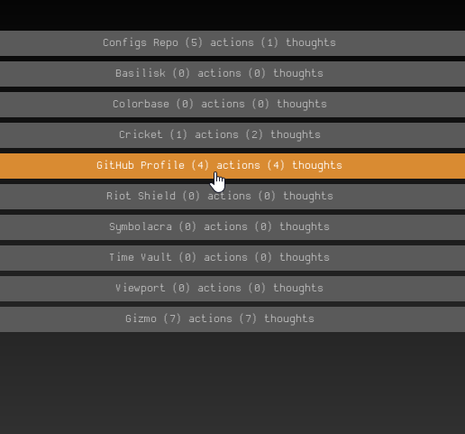

# Corvo
tiny desktop [decentralized](https://en.wikipedia.org/wiki/Decentralization) project aggregator

<p align=center>
    
</p>

### Tiny? Decentralized?
- Runs locally using minimal resources
- Projects live where they like
- Compatible with any storage solution
- Declaritively reproduced every run

### What is Corvo and what problem does it solve?
`.Corvo` is a format for documentation and issue tracking simultaneously in one file.  
`Corvo.exe` is an application that finds .corvo files, then spits out a list + filters.

If you have lots of projects, in lots of locations, and no standard issue tracking solution, Corvo could be for you.  
I made this because I needed it. **There are certainly better tools out there if you need real devops.**

### .Corvo format
Create a file named "yourprojectname.corvo". [Avoid using spaces](https://superuser.com/questions/29111/what-technical-reasons-exist-for-not-using-space-characters-in-file-names). This file contains the operations of your project. The first four lines of the file are Corvo's metadata:
```
Line 1: Title, spaces allowed here!
Line 2: Description, often for fun
Line 3: Status, what you're doing with this lately
Line 4: Tags, for filtering
```

After those lines, the rest of the file is free for you to arrange.

Lines that start with `/ ` (forward slash + space) are **actions** - these are tasks that are ready to execute. Lines that start with `. ` (period + space) are **thoughts** - these are anything that's not an action, but is still task-like. Such as a question that needs to be answered, an idea for a task that isn't fully developed, etc. The idea is that thoughts *become* tasks after some time in the oven.

Any other lines of text not starting with those is just treated as documentation, and since it doesn't matter where you put these lines, you can use them to extend some conversation around your thoughts and actions.

A Corvo file may look something like this:
```
My Awesome Project
An application that will help me do things
Currently exploring GUI frameworks
Software, Personal

/ Create a repository for sharing
/ Add .gitignore file
/ Settle on a name

. Name ideas: Kermit? Cool App? Ice Cream?
I think Kermit is a terrible name, but that's just an assumption.

. Need to figure out where to find GUI frameworks
```

### The GUI
In the GUI, you can press `/` to open up the `domains.txt` file. In there, drop a list of paths you want Corvo to look in. On start, it will parse any .corvo files it found and give you the list, with also a list of tags it found that you can click on to filter the project list. Corvo non-destructively adds the following tags while its building the list:  

"working" for any project that has > 0 actions  
"sleeping" for any project that has 0 actions  
"all" for all projects, to automatically create an "all" filter  

### The decentralized part
Corvo doesn't modify any of your files, it simply reads them where they are, and passes on the important details to the GUI. Say you have a specific device for a specific set of projects: when that device is unplugged, so are the projects. Plug it back in, and they're back. This way you can be extremely flexible about where your projects live.

> Combining Corvo with other tools like Obsidian, GitHUb, Dropbox, etc, could unlock some crazy power-user setups.

## Credits
Written by telekrex.

## License
This project is released into the public domain. See the [LICENSE](LICENSE) file for details.